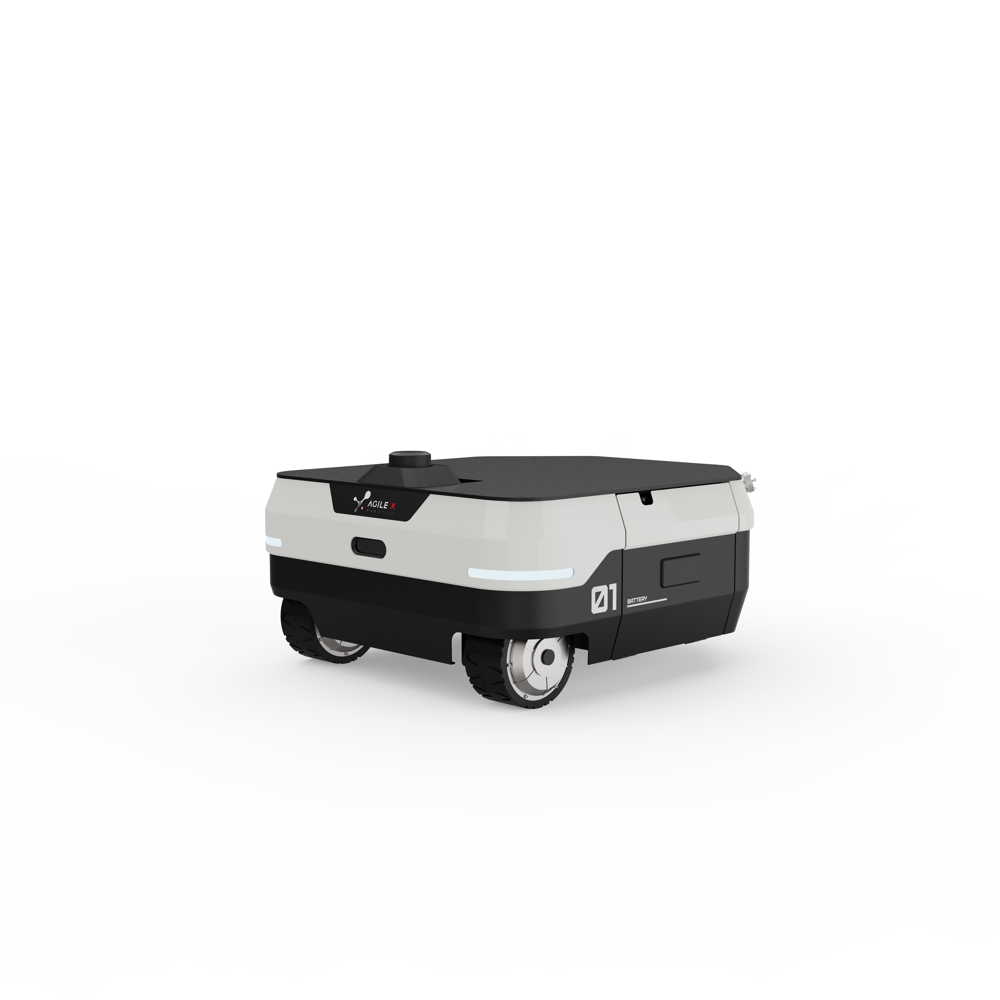
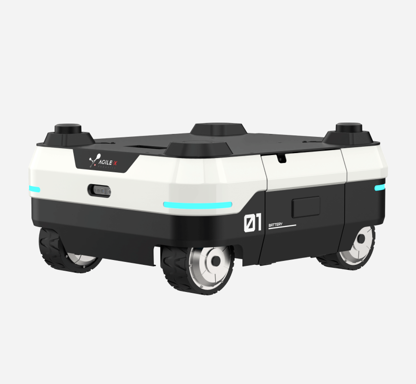

# ROS Packages for Ranger Robot

This repository contains ROS2 support packages for the Ranger Air and Ranger Delta to provide a ROS2 interface to the robot.

## Supported hardware

* Ranger Delta
  

* Ranger Air
  


## Build the package

1. Install dependencies

```bash
$ sudo apt install libasio-dev libboost-all-dev
$ sudo apt install -y ros-$ROS_DISTRO-teleop-twist-keyboard
```

2. Clone and build the packages in a catkin workspace

```bash
$ cd ~/catkin_ws/src
$ git clone https://github.com/agilexrobotics/ranger_ros2.git -b air_delta
$ cd ..
$ catkin_make
```

3. Setup CAN-To-USB adapter

* Enable gs_usb kernel module(If you have already added this module, you do not need to add it)

  ```bash
  $ sudo modprobe gs_usb
  $ sudo ip link set can0 up type can bitrate 500000
  ```

* Testing command

  ```bash
  # install can utils
  $ sudo apt install -y can-utils
  # receiving data from can0
  $ candump can0
  ```

4. Launch ROS nodes

   > Ranger Air and Ranger Delta share the same ROS2 package.

* Start the base node for ranger

  ```bash
  $ ros2 launch agx_bringup robot.launch.py
  ```

* Use keyboard to control ranger

  ```bash
  $ ros2 run teleop_twist_keyboard teleop_twist_keyboard
  ```


## ROS interface

- ### 1. /bms_alarm_warning

  - **Description**: BMS (Battery Management System) alarm and warning messages.

  ### 2. /bms_status

  - **Description**: BMS (Battery Management System) status feedback messages.

  ### 3. /chassis_motion_feedback

  - **Description**: Chassis motion data feedback messages.

  ### 4. /light_control_status

  - **Description**: Light control status feedback messages.

  ### 5. /motion_mode_feedback

  - **Description**: Motion mode feedback messages.

  ### 6. /motor_high_speed_feedback

  - **Description**: Motor high-speed feedback data messages.

  ### 7. /motor_low_speed_feedback

  - **Description**: Motor low-speed feedback data messages.

  ### 8. /remote_control_status

  - **Description**: Remote control command status feedback messages.

  ### 9. /steering_angles

  - **Description**: Four-wheel steering angle feedback messages.

  ### 10. /system_status

  - **Description**: System status feedback messages.

  ### 11. /front_wheel_odometry

  - **Description**: Wheel odometry data feedback messages.

  ### 12. /back_wheel_odometry

  - **Description**: Wheel odometry data feedback messages.

  ### 13. /wheel_speeds

  - **Description**: Four-wheel speed feedback messages.

  ### 14. /sub_cmd_vel

  - **Description**: Subscribed velocity command to drive the chassis. This topic name can be remapped in the launch file.

  ### 15. /wheel/odom

  - **Description**: Wheel odometry calculated by the chassis. This topic name can be remapped in the launch file.
